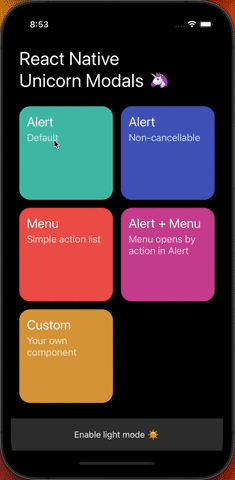

# react-native-unicorn-modals

Easy way to implement custom modals in your application via imperative API with TypeScript support. Alerts, Menus or anything you want.

<p align="center">

</p>

## Requirements

This library requires you to install **react-native-reanimated v2**. [Official documentation](https://docs.swmansion.com/react-native-reanimated/docs/fundamentals/installation).

## Setup

```js
// Import initializer function and predefined component
import { createModalProvider, Alert } from 'react-native-unicorn-modals';

// Create Provider
const Provider = createModalProvider({ alert: Alert });

// Wrap app with Provider
const App = () => {
  return (
    <Provider>
      <MyScreen />
    </Provider>
  );
};
```

## Usage

```js
import { useModals } from 'react-native-unicorn-modals';

const MyScreen = () => {
  const modal = useModals();

  const openAlert = () => modal.show('alert', {
    title: 'Title',
    description: 'Description goes here.',
    buttons: [
      { onPress: () => { console.log('Confirm pressed') }, style: 'cancel', text: 'Cancel', secondary: true },
      { onPress: () => { console.log('Confirm pressed') }, style: 'default', text: 'Confirm' },
    ],
  });

  return (
    <TouchableOpacity onPress={openAlert}>
      <Text>Open alert</Text>
    </TouchableOpacity>
  )
};
```
