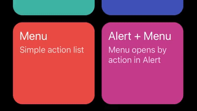

# Animations

## Internal animations

| **`fade`** | **`scale`** | **`slideUp`** (default) |
| --- | --- | --- |
|  |  |  |

```js
import {
  createModalProvider,
  Alert,
  // highlight-start
  fade,
  scale,
  slideUp,
  // highlight-end
} from 'react-native-unicorn-modals';

const Provider = createModalProvider(
  { alert: Alert },
  {
    animationDuration: 400,
    // highlight-next-line
    animationWorklet: slideUp,
  },
);
```

## Custom animations

Just create reanimated worklet function. You have an access to animation progress (from 0 to 1) in the first argument.

```js
import { interpolate } from 'react-native-reanimated';

// highlight-start
export function scaleDown(value) {
  'worklet';
  return {
    opacity: value,
    transform: [{ scale: interpolate(value, [0, 1], [1.2, 1]) }],
  };
}
// highlight-end

const ModalProvider = createModalProvider(
  { alert: Alert },
  // highlight-next-line
  { animationWorklet: scaleDown },
);
```
