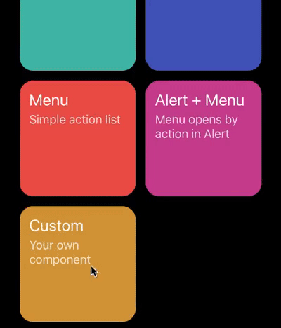

# Custom components

You can easily create custom components.

4 main things you should know:

- Component which you put into `createModalProvider` will have `WrapperComponent` prop inside.
- `children` prop of `WrapperComponent` is a [render prop](https://reactjs.org/docs/render-props.html).
- Data, which you pass when you call `show` function is available in first argument of `WrapperComponent` render function.
- Second argument is a function which returns another function to handle modal dismiss.

## Create your component

In next example we will create a component where we can pass different title and button onPress handler.

```js
import React from 'react';
import { Button, Text, View } from 'react-native';
import { useTheme } from 'react-native-unicorn-modals';

import styles from './CustomModal.styles';

const CustomModal = ({ WrapperComponent }) => {
  const theme = useTheme();
  return (
    <WrapperComponent style={styles.wrapper}>
      {({ title, onPress }, actionCallback) => (
        <View style={[styles.box, { backgroundColor: theme.cardBackgroundColor }]}>
          <Text style={[styles.title, { color: theme.titleTextColor }]}>{title}</Text>
          <Button color={theme.buttonColor} title="Close" onPress={actionCallback(onPress)} />
        </View>
      )}
    </WrapperComponent>
  );
};

export default CustomModal;
```

## Register your component

In place where you have `createModalProvider` add your component. Key will be used a first argument of `show` function.

```js
const Provider = createModalProvider({
  // Other components...
  // highlight-next-line
  customModal: CustomModal,
});
```

## Show it

Now you can initialize `useModals` hook and call the `show` function. As you can see, the first argument is a string with the same name as the key of the registered component above. The second argument is an object with props which will be available inside the `WrapperComponent`.

```js
const Example = () => {
  const modal = useModals();

  const onCustomPress = () => {
    modal.show('customModal', {
      onPress: () => console.log('Button pressed!'),
      title: 'Custom modal',
    });
  };

  return (
    <TouchableOpacity onPress={onCustomPress}>
      <Text>Open custom modal</Text>
    </TouchableOpacity>
  );
};

export default Example;
```

**Result:**


